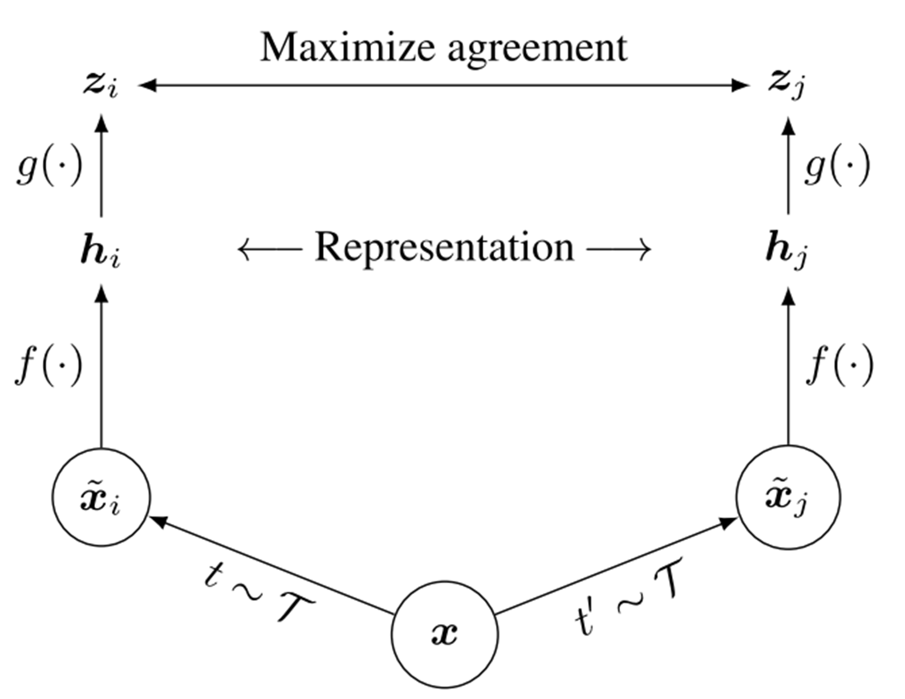
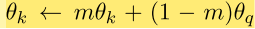

> name: liangzid mail:2273067585@qq.com
# 对比学习的浅显总结及其在NLP下的应用
最近几天看了一些和对比学习相关的论文，现整理如下：
## -1. 基本概念
对比学习（contrastive learning）是被看作是一种自监督学习方法（SSL，Self-supervised Learning），本质上是为了在数据标签的设定下为数据学习到一个良好的表示。因此，对比学习本质上仍然可以看做是一种表示（representation）学习。
下表简单列举了各个领域比较经典的对比学习算法。

<colgroup><col></colgroup>
| Field | 备注 | Paper Name |
| CV | simCLR | A Simple Framework for Contrastive Learning of Visual Representations |
| CV | Moco, he kaiming | Improved Baselines with Momentum Contrastive Learning |
| CV |  | Supervised Contrastive Learning |
| Analysis |  | Intriguing Properties of Contrastive Losses |
| NLP | Hinton组 | DeCLUTR: Deep Contrastive Learning for Unsupervised Textual Representations |
| NLP | Liuzhiyuan组 | DeepChannel: Salience Estimation by Contrastive Learning for Extractive Document Summarization |
| NLP |  | CERT: Contrastive Self-supervised Learning for Language Understanding |	

其中，最著名的对比学习方法是CV领域的simCLR和MOCO。除此之外，也有将对比学习迁移至NLP的一些工作，当然由于Contrastive Learning的根本目的仍然在于提取表示，所以这一类的方法主要是在NLU上进行的。当然，上表中也整理了另外的一些工作，比如，针对于对比学习的“自监督学习”的特性，将Contrastive learning应用在异常检测等领域的工作。除此之外，一些比较特殊的、进行理论纯分析的工作也被展示了出来。现对这些工作进行一一介绍。
## 0. 基本特点和基本框架
还是要再罗嗦几句。
在介绍真正的contrastive learning的工作之前，十分有必要再强调一下其基本特点。怎么样看一篇工作是不是使用了对比学习的方法？是因为论文的题目取了这个名字吗？是因为他也是一种自监督学习方法吗？不是的。通常而言，对比学习包括以下几个明显的步骤：
1. data augmentation.
2. representation extraction.
3. projection.
4. similarity  based loss with temperature.
其中，最重要的是第一步（数据增强）和第三步（projection）。至于第四步的损失函数，如果你把log公式打开，你会发现他和常见的metric learning是具有很大的共通之处的，和其他的一些triple loss也说不出太大的区别。但是，通过增强的方式去构造不同的变体，之后再使用projection（一般是MLP）对提取得到的表示进行映射，这是典型的contrastive learning的思想。

这样说存在一定的片面性，且对不了解之的读者不友好。下面通过几个例子复述上一过程。

## 1. simCLR：一个简单的使用强化学习去学到一个表示提取器的方法

上图是对比学习里的经典图示，这张图的经典之处在于它不仅确定了对比学习的经典范式，也把整个道理讲得十分清楚。
上图所讲的过程用文字表达为：
0. 对于一个样本x，定义对这类样本所进行的所有增强方法（CV领域如滤波、剪切、旋转等等）族T；
1. 随机从族T中抽取两种增强方法t1和t2，并施加在样本x上，获得增强后的样本（也就是变体）xi，xj。
2. 使用特征提取器f()提取两个变体的特征（表示）；
3. 使用g()分别对两表示做映射；
4. 构造一个损失函数，使得两表示映射后的表达相似度尽可能高。
当然，这里面存在着一些细节，比如：
1. 特征提取的f,两边是不是同一个？参数更新的时候，如何对他们进行更新呢？
2. 设计损失函数的细节？
但是，单单从上面的这张图里，我们就已经把这个模型吃的差不多了。还是先看一下直观的数据增强吧。

没什么好讲的，贴了这张图应该就，，懂的都懂了。
下面再看看关于损失函数的形式。

这个损失函数前面有一个负号，所以其实是最大化后面的对数损失。这个损失的形式本质上是一个softmax的形式，所以表达的就是：当前的这一对数据增强之后的相似度，在整体的各个相似度计算中所占的比例。这个比例按照损失函数的需求是越大越好，也就代表了要相同的样本出来的变体尽可能的相似，而不同的样本出来的不同变体之间的差距尽可能的大。关于分母：分母是一个简写的形式，一般而言，分母一共是2N，相当于一个batch里有N个样本，然后每个样本有两种增强之后的变体（这个是图中展现出来的）。
## 2. Moco：Momentum Contrastive Learning
这篇是有何凯明大神参与的工作，来自FacebookAI，论文只有三页。这篇论文也是CV领域的，这篇论文是对上一篇论文的更新，解决的主要是SimCLR的低效性。simCLR的低效性主要来自于：
1. simCLR需要较大的batch才能维持负样本的全分布，也就是说，只有N较大时，这种无监督学习方法才能有效。这一点比较容易理解，可以同与信息上类似的角度进行理解；
2. simCLR结构本质上包含了两个不存在强耦合的encoder，一般最后使用的时候只会只用其中一个。如何对这个encoder进行更新，也是需要进行考虑的。

也就是针对这两个问题，Moco采用了简单而高效的策略进行调整。
1. 对N和batch的大小进行解耦：维持一个queue（长度为N），损失函数里的全样本从“一个batch里的所有样本”变为“queue中的所有样本”；
2. 对两个encoder进行关联：使用momentum的方式更新encoder

具体而言就是：
### queue
queue就是队列，也就是使用这样的数据结构。队列的长度为N。每到来一个新样本，即加入队列，然后先入先出维持总量为N。这样即使使用一个较小的batch，也可以获得较大的N用以计算损失
### momentum updating
负样本的encoder总是比对照组在更新上慢一拍。

如下图如所示：

从图中可以看出，momentum encoder并没有完全仿照encoder，而是还顺带包含一些“过去的成分”，用公式来表达：

## 3. 对比学习在NLP中的应用

主要在NLU上，毕竟NLU的使用思路中存在着“学习表示”这个步骤。

<colgroup><col></colgroup>
| Field | 备注 | Paper Name |
| NLP | Hinton组 | DeCLUTR: Deep Contrastive Learning for Unsupervised Textual Representations |
| NLP | Liuzhiyuan组 | DeepChannel: Salience Estimation by Contrastive Learning for Extractive Document Summarization |
| NLP |  | CERT: Contrastive Self-supervised Learning for Language Understanding |	

上述多篇论文都用到了这种策略。现在简单以CERT为例进行介绍。

CERT是在BERT等预训练模型的基础上加入自监督学习任务训练得到的。那么问题来了；什么要加入contrastive self-supervised learning task（CSSL）？bert的预训练任务不香吗？

论文中认为，BERT的任务是token-based的，在获取句子的表示上，融合了对比学习任务的模型比单纯CLS的结果要更好。

下图是CERT的训练流程：

可以看出，仅仅是多加了一层罢了。

现在我们来看一看CERT是如何设计CSSL的。无聊的是，这些任务在较大程度上借鉴了前面提及的Moco。

我们知道，对比学习框架下的基本要素有：
1. data augmentation.
2. representation extraction.
3. projection.
4. similarity  based loss with temperature.

在CERT中，数据增强的方式是回译（back translation, 就是翻译成另一张语言，再翻译回来）。

其他一些论文里也定义了各种其他的augmentation的方法，寻找一种有效的增强方法也是十分必要的，此处就不赘述。

在CERT，提取表示理所当然用的是BERT。而剩下的部分，就是全全仿照MOco了。

## 4. 对比学习在图（Graph）上的应用

有空再写吧。

## 5. 对比学习的其他应用
### 5.1 异常检测
