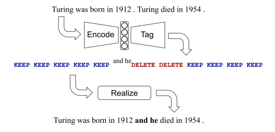

> name: liangzid mail:2273067585@qq.com
# laser tagger
这篇论文是做什么的？

这篇论文是做文本编辑工作的。文本编辑和NLG稍微有些不同，主要是在原始的输入之上修修改改，而非直接凭空生成一个什么东西。

这篇论文的输入是什么？输出是什么？模型是什么？

1. 输入：自然语言文本
2. 输出：自然语言文本
3. 模型：BERT，输出标签；或者BERT+transformer-encoder，输出token对应的索引。

这篇论文主要包含哪几个步骤？

三个步骤：
1. encode，也就是编码；
2. tagging，也就是打上标签；
3. realize，也就是基于规则对打上标签的部分token进行变动。

其中，tagging主要包括三种，这三种是基于规则而定义的：
1. keep： 对应的token保持不变；
2. delete：对应的token删除；
3. adding：在对应的token前面添加token组
