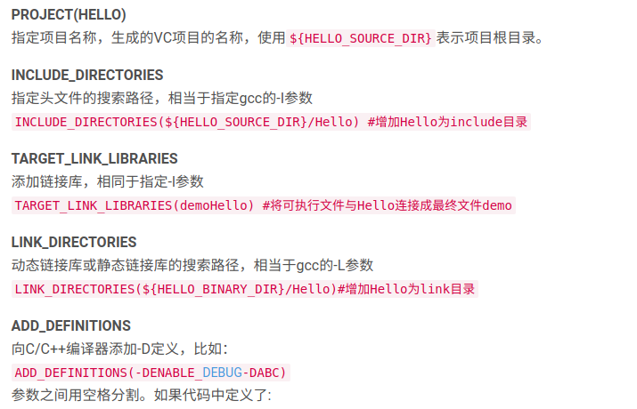
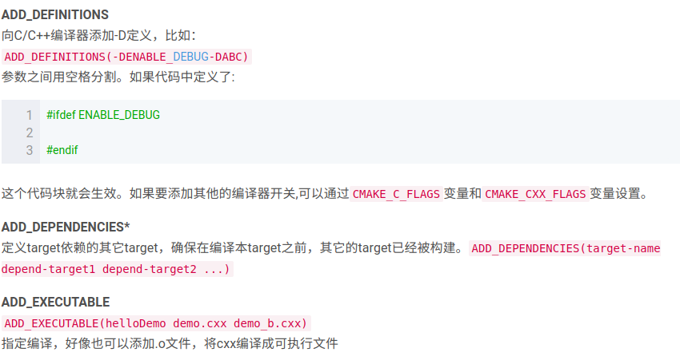
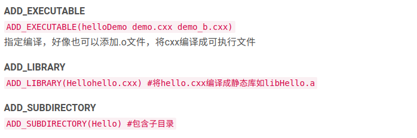

# CMakeLists文件编写学习

> cmake是编译Ｃ*项目的一种工具，其中的关键就在于如何编写CmakeLists文件.本篇文章是对此进行的学习笔记.
>
> 参考文献:[CMake知识](<https://www.cnblogs.com/cv-pr/p/6206921.html>),

## 使用cmake编译

常用的三部曲是:

```shell
mkdir build
cd build
cmake ..
make -j 2 #线程数
sudo make install #如果需要安装的话才会有这一步
```

上述实现的功能是:新建一个文件夹并导入,之后cmake根据文件夹外的所有文件(也就是这个项目的文件,camke 的地方要有CMakeLists.txt文件)生成Makefile文件,之后使用make进行编译生成可执行程序或**共享库(so文件,shared object)**.

## 编写CMakeLists.txt文件的一般规则

首先给出一个例子:

```txt
#1. 指定CMake版本
cmake_minimum_required(VERSION 3.2)
#2. 项目名称
PROJECT(Control)
#3. 头文件目录,相当于gcc中的-l方式
INCLUDE_DIRECTORIES(
include
)
#4. 源文件目录
AUX_SOURCE_DIRECTORY(
src DIR_SRCS
)
#5.设置环境变量，编译用到的源文件全部都要放到这里，否则编译能够通过，但是执行的时候会出现各种问题，比如"symbol lookup error xxxxx , undefined symbol"
SET(TEST_MATH
${DIR_SRCS}
)
#6.添加要编译的可执行文件
ADD_EXECUTABLE(${PROJECT_NAME} ${TEST_MATH})
#7.add link library，添加可执行文件所需要的库，比如我们用到了libm.so（命名规则：lib+name+.so），就添加该库的名称
TARGET_LINK_LIBRARIES(${PROJECT_NAME} m)

```

尽管这个例子都做了很多注释,但是仍然有很难理解的部分.下面是一些简单的分析,通过这些分析我加深了对CMakeLists文件编写的理解.

### 变量的显式定义

一般采用SET(),比如 

```
SET(TEST_MATH liangzi.c)
```

之后就可以使用${TEST_MATH}来引用liangzi.c文件了.

### 变量引用方式

上面已提及.使用${ }格式来进行.这个linux系统的环境变量使用的方法是很相似的.

### 常用指令再次解释

根据[此处](<https://blog.csdn.net/z_h_s/article/details/50699905>)的列举,常见的指令有如下:







## 各种编译库的具体含义


