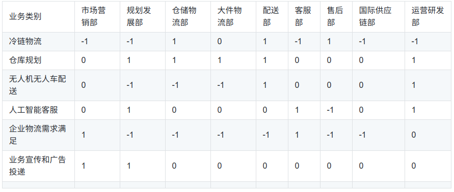
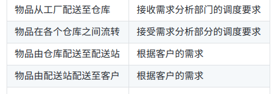

# 需求分析报告--以京东物流为例

> 京东物流介绍:随着无界零售时代的到来，京东物流作为无界物流的引领者和实践者，以降低社会物流成本为使命，致力于成为全球供应链基础设施服务商。
> 将基于短链供应，打造高效、精准、敏捷的物流服务；
> 通过技术创新，实现全面智能化的物流体系；
> 与合作伙伴、行业、社会协同发展，构建共生物流生态。
> 通过智能化布局的仓配物流网络，京东物流为商家提供_仓储、运输、配送、客服、售后_的正逆向一体化供应链解决方案、_快递、快运、大件、冷链、跨境、客服、售后_等全方位的物流产品和服务以及_物流云、物流科技、物流数据、云仓_等物流科技产品。目前，京东物流是全球唯一拥有_中小件、大件、冷链、B2B、跨境和众包（达达）_六大物流网络的企业。

## 系统调研(分为定性调查和定量调查)

### 调查方式

1. 京东物流热线:950616.
2. 调查来源:http://www.jdwl.com/ (京东物流官网)
3. 京东派东北大学南湖站
4. 沈阳 京东物流配送中心
5. 已有的分析论文

### 组织结构调查

运营体系负责人:

 + 运营管理部
   - 物流开放业务部(市场营销)
   - 物流规划发展部(战略部)
   - 仓储物流部(负责收发存退和增值服务,包括仓间调拨代贴条码个性包装B2B服务库内加工动产质押前台搜索打标)
   - 大件物流部(仓配安一体化,上门安装,售后)
   - 配送部(211,隔日达)
   - 客服部(维持客户关系)
   - 售后部(产品检测,商品良品化)
   - 国际供应链部
   - 运营研发部JDX(无人仓无人机无人车)
 + 办公室

### 功能

见上面
## 业务流程调查
### 业务列举

记录一个矩阵:其中数值1代表直接相关,数值-1代表无直接关系,数值0代表无关.

## 现行系统状态

### 目标

在工厂->仓库,仓库->仓库,仓库->用户的过程中尽可能达到最优.

### 主要功能

|      |      |
| ---- | ---- |
|      |      |

### 用户需求

实现上述目标和功能的系统.

## 信息流程调查

### (采购)分拣分配业务流程

### 仓库间物品调运流程

### 货物配送流程

## 数据及功能分析 

### 

## 系统运营环境调查

