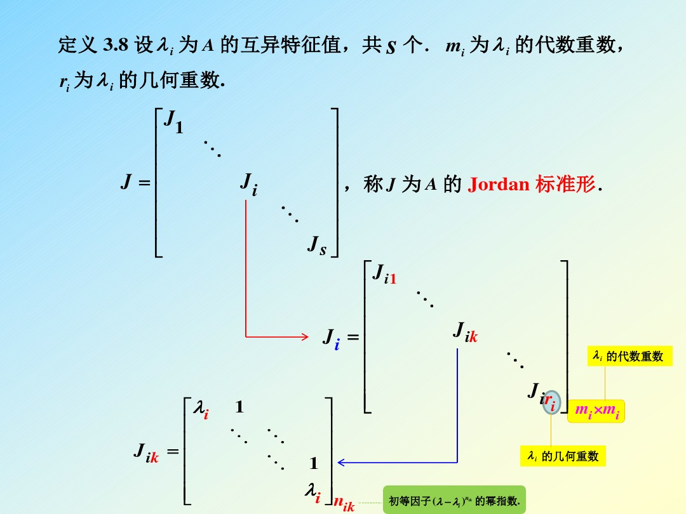

# 重新学习线性代数(一)

> 写这篇文章是主要目的是为了解决在学习**现代控制理论**中所遇到的困难.

## $\lambda$矩阵

### 什么是$\lambda$矩阵?

矩阵中的元素是以$\lambda$为自变量的多项式的矩阵称之为$\lambda$-矩阵(或多项式矩阵).

### $\lambda$-矩阵的秩和n阶$\lambda$-阵的奇异性

略,和数矩阵一致.只要$\lambda$矩阵中有一个r阶子式不为零而所有r+1阶子式全为零,则称该矩阵的秩为r,即$rank(A)=r$

,如果n阶方阵满足$rank(A)=n$,则称之为满秩(非奇异).

### 可逆$\lambda$矩阵的行列式一定是一个非零**常数**

一定是**常数**,$\lambda$的多项式也不行.

### 初等变换和初等矩阵

与数矩阵一致.$\lambda$矩阵的初等变换和初等矩阵都是==可逆==的

### 矩阵的等价

与数矩阵一致.两个$\lambda$矩阵等价的充要条件是:==两个矩阵是同型的(阶次相同)可以通过有限次初等变换互相转化==.

一般记作 $A(\lambda)\cong B(\lambda)$

显然,等价的两个矩阵具有相同的秩.

### smith标准型(与smith正交化区分)

对于$\lambda$矩阵A($\lambda$),假设$rank(A)=r$,存在

$$A(\lambda)\cong D(\lambda)=\left [ \begin{matrix}d_1(\lambda) & 0 & \cdots &0 \\0 & d_2(\lambda) & \cdots & 0 \\ \cdots & \cdots & \cdots & \cdots \\ \cdots & \cdots & d_r(\lambda) & 0 \\ \cdots&\cdots&\cdots&0_{matrix} \end{matrix}\right ]$$

其中,$d_i(\lambda)​$为首项为1的多项式.

定义矩阵D($\lambda$)为A矩阵的Smith标准形.

### 不变因子与初等因子

不变因子即为上面的$d_i(\lambda)$,类似于实矩阵的特征值.

对每个$d_i(\lambda)$进行因式分解,所有正整数次幂的因子项(诸如$(\lambda-\lambda_j)^{k_{ij}}$之流)称为矩阵A的初等因子.

两个矩阵等价的充要条件:拥有相同的初等因子组且秩相同(二者缺一不可).

## 矩阵Jordan标准型

首先将实矩阵转化为$\lambda​$矩阵.

如果矩阵A与矩阵B等价,则$\lambda​$E-A也与$\lambda​$E-B等价.这样就可以看出两个$\lambda​$矩阵需要具有相同的初等因子组和相同的秩.

首先给出**现控**课上讲的***重数***的拓展

### 代数重数与几何重数

对于n阶矩阵A,如果$\lambda_i​$是关于A的互异特征值,则有

$$det(\lambda E-A)=\Pi_{i=0}^{n}(\lambda-\lambda_i)^{m_i}​$$

其中$\Sigma m_i=n​$,称$m_i​$为代数重数,但是代数重数未必能够反应Jordan块的性质,所以需要几何重数的概念.

> 几何重数:对于特征值$\lambda _i$,其特征向量所构成的线性空间记为$V_i$,则其几何重数被定义为$r_i=dim(V_i)$.

关于几何重数,还有一种计算方法是:$r_i=n-rank(\lambda E-A)$

根据代数重数和几何重数的讨论,可以发掘:

1. 几何重数一定不会大于代数重数
2. 如果矩阵A的每个特征值的几何重数都和代数重数相等,则矩阵A是和由特征值构成的对角阵等价的.(思考==存疑==:当几何重数等于其代数重数时,特征向量所构成的线性空间就是满秩的,因而他们之间可以进行互相的转化?)
3. 当2无法满足时,便找不到一个对角阵来等价于矩阵A,但是在与A相似的所有矩阵中可以找出一种形式最简单的矩阵,称之为Jordan.下面会详细说明.

下图详细说明了Jordan标准型的形式:

对于每个特征值,都有一个分块矩阵$J_i$与之对应,而$J_i$可以看作是分块矩阵的叠加(这种叠加主要来源于几何重数与代数重数的差值)

### Hamilton-Cayley 定理

设A是N阶矩阵(元素必须是数),定义$\phi(\lambda)=det(\lambda E-A)$,则有

$\phi(\lambda)=det(\lambda E-A)=\lambda^n+a_1\lambda^{n-1}+\cdots+a_n$

上述等式是有限多项和方法的美妙使用手段(证明的n次方可由低阶线性表出进而给出有限多项就可以表现出无穷多项的原理),而其还有如下结论:

$\phi(A)=O$

上述多项式称之为化零多项式.

一个矩阵会有很多化零多项式,至少会有一个尤其特征值对应的.这些化零多项式中首项系数为1的次数最小的那个化零多项式被称为**最小多项式**,相似矩阵具有相同的最小多项式.

