> name: liangzid mail:2273067585@qq.com

> 最近在做课程设计，需要进行机器人相关方面的学习，本篇笔记是在进行了控制算法论文的阅读时的笔记。
# 论文阅读笔记
代码位置链接：https://www.sciencedirect.com/science/article/pii/S0005109812005675
## unicycle model基础
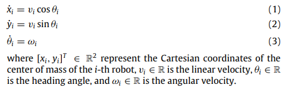
如图所示，我们可以很简单地得到上述图示的状态方程。
对其进行求导，可得：
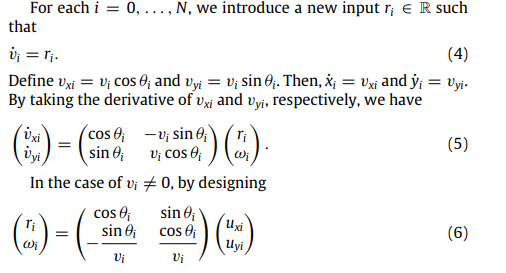
如上图所示，如何设计合理的控制量u使得被控对象的加速度r和角速度w得到合理的控制，是控制器设计的目标。
## 编队控制简介
在编队控制中，我们知道有N+1个被控对象且N_0为leader，其他为从动。实现的效果为各个无人车之间保持一定的间距并且跟随leader的移动。这种关系通常采用下面的数学公式进行描述：

可以看出，如果系统问题，且dx_i的数值也为0的话，整体的给定量即为0.
## 引理
### 标准型
本着以上想法，论文给出了一个一般情况：
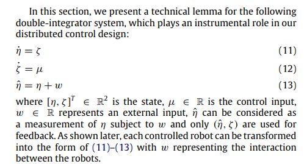
针对这个对象，我们可以发现：
公式（11），（12）是简单的能控标准型。公式（13）则可以看出是一个观测值。这个观测值的定义值得深思，因为他使用的是“加法”，论文给出的理由是这个w代表的是机器人之间的interaction（相互影响），我们姑且信之。
### 引理1
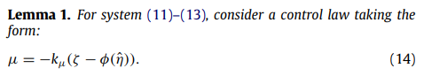

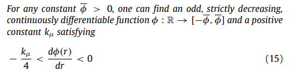

观察公式（14），可以看出该公式采用的是类似于线性反馈的东西来定义的，根据现控所学，此处应为：u=-kx，本着这个思想，我们可以把上述式子改写为：$u=- k_u*( \[1,-1* phi \* ] * (\[kesai,yite]^{T} +\[0,omiga]^{T}))$这样就找到了二者之间的异同。（其中的phi是算子。类似于电气传动课本里的矩阵表达）

论文作者在这些东西的基础上，给出了一个新鲜的结论:如果能够满足公式(15)的话，设计的控制器就是UO且IOS的！
关于UO和IOS的表述论文中有，其数学描述为：
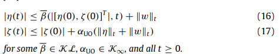
关于两个函数空间的定义，论文中也有，可见：
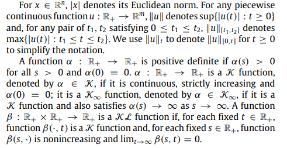
## 控制器设计
### before design
下面的工作就是控制器的设计。在设计之前，需要考虑公式（6）的存在问题
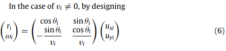
毕竟分母是不能存在0的。
为了解决这个问题，经过了下图所示的一系列推导，从而成功求得了从车的速度和主车的速度的差值应该遵循的两个上界。这两个上界的下届就是需要满足的要求。
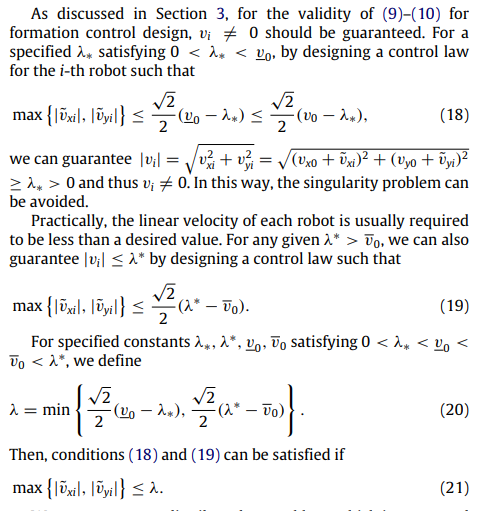
经过这个要求之后，就可以发现：只要经过了有限的时间，就可以使得两个速度的差值达到这个要求，从而开始进行控制。因而，整个系统的流程应该分为两步：1）初始化系统，使得其满足上述条件。2）开始进行编队控制。
事实上，下面的内容就是围绕这二者展开。
## 初始化环节
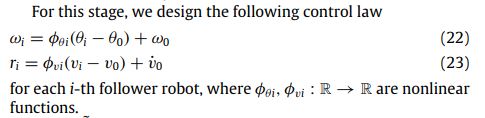
论文作者首先进行了上述定义。上述定义是什么？从车的速度和主车的速度有关，还和主车与从车之间的速度的积分的差距有关。且后者的关系是非线性的。这个点很有道理，但是属于启发性。
如果将其中的leader的速度移项至左侧，可以得出：
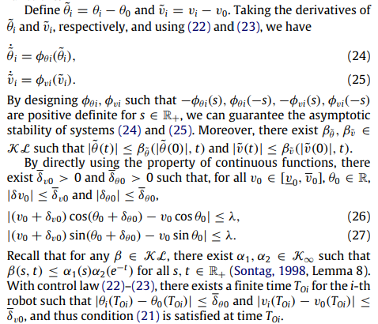
公式（24）（25）可以看作是新的状态方程，并且：如果我们能够合理设计这个非线性函数的话，很显然可以使得该状态方程渐近稳定。然后，基于渐近稳定的连续函数性质，就可以得出公式（26）（27）了。（虽然不知道是怎么得到的）
### 编队控制
初始化之后就是进行编队控制了。
首先根据前面给出的公式（14），可以得到下面两个具体的式子
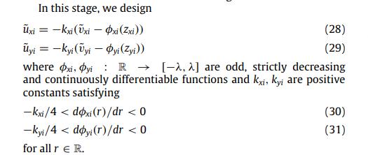
这里的Z就是之前的yite尖哦！我们知道，他是由实际的状态值和不同无人车之间的干扰相加而成的，在此处其定义为：
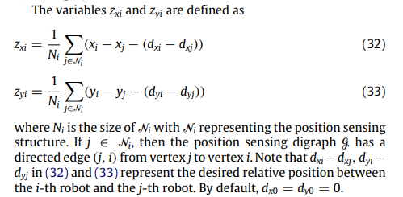
这里采用的是有向图的描述方式。即如果无人车i被控，那么在这里就需要约束他和所有控制的无人车的距离信息。这里面既有实际的相对位置（前两项的差值），也有理想期望的相对位置（后两项的差值，可以看作给定），二者的差值就是我们的反馈信号，也就是狭义控制器的输入。
然后，上述公式还可以进行如下变形。
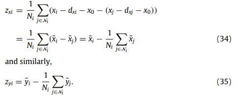
# MATLAB相关代码分析
	

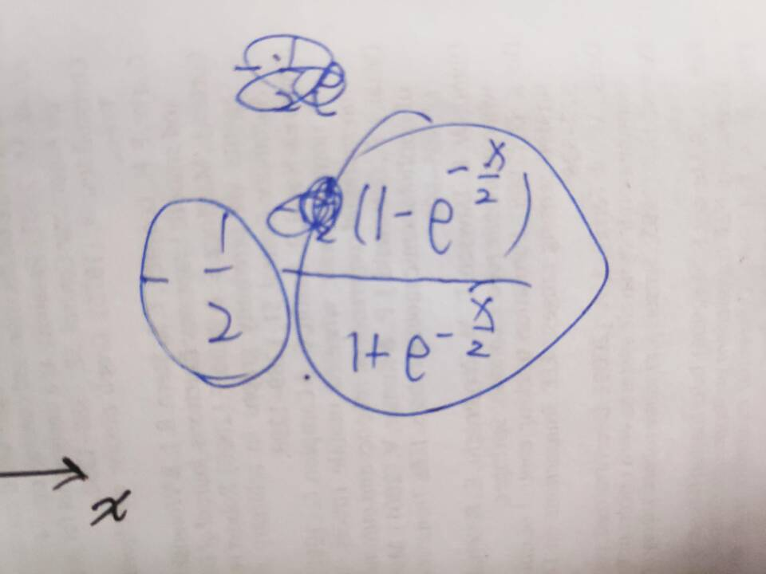

